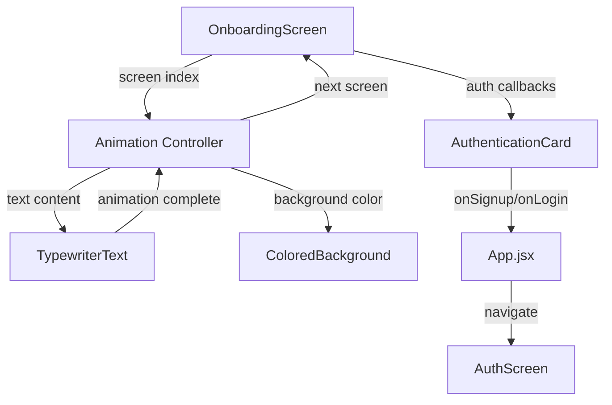

# Design Document: Animated Onboarding Screen

## Overview

The animated onboarding screen is a visually engaging introduction to Sentri that appears before authentication. It features a typewriter animation that cycles through four screens, each with distinct text and solid color backgrounds. A fixed authentication card remains at the bottom throughout the animation, allowing users to sign up or log in at any time.

### Key Design Decisions

1. **Animation-First Approach**: Use React Native's `Animated` API for smooth, performant animations without external dependencies
2. **Component Composition**: Separate concerns into distinct components (OnboardingScreen, TypewriterText, ColoredBackground, AuthenticationCard)
3. **State Machine Pattern**: Manage screen transitions and animation states using a simple state machine
4. **Integration Point**: Replace the current AuthScreen with OnboardingScreen as the initial unauthenticated view in App.jsx

### Technical Constraints

- Must work on both iOS and Android without platform-specific code
- No external animation libraries (use React Native's built-in Animated API)
- Must integrate seamlessly with existing authentication flow
- Must use existing design tokens for consistency

---

## Architecture

### Component Hierarchy

```
OnboardingScreen (Container)
├── ColoredBackground (Animated)
├── TypewriterText (Animated)
│   └── AnimatedDot (Animated)
└── AuthenticationCard (Static)
    ├── AppleButton
    ├── GoogleButton
    ├── EmailButton
    └── LoginLink
```

### Data Flow



### State Management

The OnboardingScreen component manages the following state:

- `currentScreenIndex`: Number (0-3) indicating which screen is active
- `isAnimating`: Boolean indicating if typewriter animation is in progress
- `displayedText`: String containing the currently visible text
- `dotPosition`: Animated.Value for the animated dot's horizontal position
- `backgroundColor`: String value for the current background color

---

## Components and Interfaces

### OnboardingScreen Component

**Purpose**: Container component that orchestrates the entire onboarding experience

**Props**:
```typescript
interface OnboardingScreenProps {
  onSignup: (method: 'apple' | 'google' | 'email') => void;
  onLogin: () => void;
}
```

**State**:
```typescript
interface OnboardingScreenState {
  currentScreenIndex: number;
  isAnimating: boolean;
}
```

**Responsibilities**:
- Manage screen progression (0 → 1 → 2 → 3 → 0)
- Coordinate timing between typewriter animation and screen transitions
- Pass appropriate callbacks to AuthenticationCard
- Stop animation loop when user interacts with authentication options

**Key Methods**:
- `startScreenAnimation()`: Initiates typewriter animation for current screen
- `handleAnimationComplete()`: Triggered when typewriter finishes, waits 1.5s, then advances to next screen
- `handleAuthAction()`: Stops animation loop and invokes appropriate callback

---

### TypewriterText Component

**Purpose**: Renders text character by character with an animated dot

**Props**:
```typescript
interface TypewriterTextProps {
  text: string;
  onComplete: () => void;
  speed: number; // milliseconds per character (default: 80)
}
```

**State**:
```typescript
interface TypewriterTextState {
  displayedText: string;
  currentIndex: number;
  dotPosition: Animated.Value;
}
```

**Animation Logic**:
1. Start with empty string and dot at position 0
2. Every `speed` milliseconds, add next character to displayedText
3. Animate dot position to the right as text grows
4. When text includes "●", hide the animated dot (it becomes part of the text)
5. Call `onComplete()` when all characters are displayed

**Styling**:
- Font size: 48px (custom large title)
- Font weight: 800 (extra bold)
- Color: White (#FFFFFF)
- Line height: 56px
- Text alignment: Left
- Padding: 20px horizontal

---

### ColoredBackground Component

**Purpose**: Renders an animated solid color background that transitions between screens

**Props**:
```typescript
interface ColoredBackgroundProps {
  color: string; // Hex color value
  transitionDuration: number; // milliseconds (default: 800)
}
```

**Implementation**:
- Use `Animated.View` with interpolated background color
- Smooth transitions using `Animated.timing` with easing

**Color Schemes** (from requirements):
1. Screen 0: Blue (`'#1A73E8'`)
2. Screen 1: Teal (`'#00BFA5'`)
3. Screen 2: Cream (`'#FFF8E1'`)
4. Screen 3: Dark Green (`'#2E7D32'`)

**Note**: React Native supports animated backgroundColor directly with `useNativeDriver: false`.

---

### AnimatedDot Component

**Purpose**: Visual indicator that moves with the typewriter animation

**Props**:
```typescript
interface AnimatedDotProps {
  position: Animated.Value;
  visible: boolean;
}
```

**Styling**:
- Character: "●"
- Font size: 48px (matches TypewriterText)
- Color: White (#FFFFFF)
- Position: Absolute, animated via `translateX`

**Behavior**:
- Appears at the start of each screen
- Moves right as characters are typed
- Disappears when the text includes "●" character

---

### AuthenticationCard Component

**Purpose**: Fixed card at the bottom with authentication options

**Props**:
```typescript
interface AuthenticationCardProps {
  onApplePress: () => void;
  onGooglePress: () => void;
  onEmailPress: () => void;
  onLoginPress: () => void;
}
```

**Layout**:
- Position: Absolute, bottom of screen
- Width: 100% with horizontal padding (20px)
- Background: White surface with shadow
- Border radius: 28px (theme.radius.xl)
- Padding: 24px
- Shadow: theme.shadow.strong

**Child Components**:
1. **AppleButton**: White background, black text, Apple icon
2. **GoogleButton**: Dark background (#111111), white text, Google icon
3. **EmailButton**: Dark background (#111111), white text, envelope icon
4. **LoginLink**: Text link, centered, accent color

**Button Styling**:
- Height: 52px
- Border radius: 18px (theme.radius.md)
- Font size: 15px (theme.typography.body)
- Font weight: 700
- Gap between buttons: 12px

---

## Data Models

### Screen Configuration

```typescript
interface OnboardingScreen {
  id: number;
  text: string;
  backgroundColor: string;
}

const ONBOARDING_SCREENS: OnboardingScreen[] = [
  {
    id: 0,
    text: 'Sentri●',
    backgroundColor: '#1A73E8',
  },
  {
    id: 1,
    text: 'Your student companion●',
    backgroundColor: '#00BFA5',
  },
  {
    id: 2,
    text: 'Timetables made easy●',
    backgroundColor: '#FFF8E1',
  },
  {
    id: 3,
    text: "Let's begin●",
    backgroundColor: '#2E7D32',
  },
];
```

### Animation Timing Configuration

```typescript
interface AnimationConfig {
  typewriterSpeed: number; // 80ms per character
  pauseAfterScreen: number; // 1500ms pause after animation completes
  colorTransitionDuration: number; // 800ms for color transition
}

const ANIMATION_CONFIG: AnimationConfig = {
  typewriterSpeed: 80,
  pauseAfterScreen: 1500,
  colorTransitionDuration: 800,
};
```

---

## Error Handling

### Animation Errors

**Scenario**: Animation timing gets out of sync or fails to complete

**Handling**:
- Implement timeout fallback: If animation doesn't complete within expected time (text.length * typewriterSpeed + 500ms), force completion
- Log warning to console for debugging
- Ensure screen progression continues even if animation fails

**Implementation**:
```javascript
useEffect(() => {
  const timeout = setTimeout(() => {
    if (isAnimating) {
      console.warn('Typewriter animation timeout, forcing completion');
      handleAnimationComplete();
    }
  }, text.length * ANIMATION_CONFIG.typewriterSpeed + 500);
  
  return () => clearTimeout(timeout);
}, [isAnimating, text]);
```

### Gradient Rendering Errors

**Scenario**: Gradient library fails to load or render

**Handling**:
- Fallback to solid color background using the first color in the gradient array
- Log error to console
- Continue with animation (degraded experience is better than broken experience)

### Authentication Callback Errors

**Scenario**: onSignup or onLogin callbacks throw errors

**Handling**:
- Wrap callback invocations in try-catch blocks
- Display error message to user (reuse existing Toast component if available)
- Allow user to retry authentication action
- Don't stop animation loop on error (user can try again)

---

## Testing Strategy

This feature involves UI rendering, animations, and user interactions. The testing strategy focuses on:

### Unit Tests

**TypewriterText Component**:
- Test that text is revealed character by character
- Test that onComplete callback is invoked when animation finishes
- Test that displayedText state updates correctly
- Test edge cases: empty string, single character, text with special characters

**GradientBackground Component**:
- Test that gradient colors are applied correctly
- Test that color transitions occur when colors prop changes
- Test fallback to solid color if gradient fails

**AuthenticationCard Component**:
- Test that all buttons render correctly
- Test that callbacks are invoked when buttons are pressed
- Test button styling and layout

**OnboardingScreen Component**:
- Test screen progression: 0 → 1 → 2 → 3 → 0
- Test that animation stops when authentication action is triggered
- Test that correct callbacks are passed to child components

### Integration Tests

**Full Onboarding Flow**:
- Test complete animation cycle through all four screens
- Test that animation loops back to first screen
- Test that tapping "Sign up with email" navigates to AuthScreen in signup mode
- Test that tapping "Log in" navigates to AuthScreen in login mode

**App.jsx Integration**:
- Test that OnboardingScreen is shown when user is not authenticated
- Test that AuthScreen is shown after user selects authentication method
- Test that authenticated users bypass OnboardingScreen

### Manual Testing Checklist

- [ ] Animation plays smoothly on iOS simulator
- [ ] Animation plays smoothly on Android emulator
- [ ] Animation plays smoothly on physical iOS device
- [ ] Animation plays smoothly on physical Android device
- [ ] Gradient transitions are smooth and visually appealing
- [ ] Typewriter animation speed feels natural (not too fast or slow)
- [ ] Animated dot moves in sync with text
- [ ] Authentication card remains fixed during animations
- [ ] Tapping authentication buttons stops animation and navigates correctly
- [ ] Animation loops continuously until user interaction
- [ ] No memory leaks after multiple animation cycles
- [ ] No performance degradation after extended viewing

### Accessibility Testing

- [ ] VoiceOver (iOS) announces screen content correctly
- [ ] TalkBack (Android) announces screen content correctly
- [ ] Authentication buttons have proper accessibility labels
- [ ] Focus order is logical (top to bottom)
- [ ] Color contrast meets WCAG AA standards (white text on gradient backgrounds)

**Note**: Full WCAG compliance validation requires manual testing with assistive technologies and expert accessibility review.

### Performance Testing

**Metrics to Monitor**:
- Frame rate during animation (target: 60fps)
- Memory usage during animation loop (should remain stable)
- Time to first render (should be < 500ms)

**Tools**:
- React Native Performance Monitor
- Xcode Instruments (iOS)
- Android Profiler (Android)

---

## Integration with Existing Auth Flow

### App.jsx Modifications

**Current Flow**:
```javascript
if (!authenticatedUser) {
  return <AuthScreen mode={authMode} ... />;
}
```

**New Flow**:
```javascript
if (!authenticatedUser) {
  if (showOnboarding) {
    return (
      <OnboardingScreen
        onSignup={(method) => {
          setShowOnboarding(false);
          if (method === 'email') {
            setAuthMode('signup');
          } else {
            // Handle Apple/Google auth
          }
        }}
        onLogin={() => {
          setShowOnboarding(false);
          setAuthMode('login');
        }}
      />
    );
  }
  return <AuthScreen mode={authMode} ... />;
}
```

### State Management

Add new state to App.jsx:
```javascript
const [showOnboarding, setShowOnboarding] = useState(true);
```

**Persistence Logic**:
- First-time users: `showOnboarding = true`
- Returning users: `showOnboarding = false` (stored in AsyncStorage)
- Key: `@sentri:hasSeenOnboarding`

**Implementation**:
```javascript
useEffect(() => {
  const checkOnboardingStatus = async () => {
    const hasSeenOnboarding = await AsyncStorage.getItem('@sentri:hasSeenOnboarding');
    if (hasSeenOnboarding === 'true') {
      setShowOnboarding(false);
    }
  };
  checkOnboardingStatus();
}, []);

const handleOnboardingComplete = async () => {
  await AsyncStorage.setItem('@sentri:hasSeenOnboarding', 'true');
  setShowOnboarding(false);
};
```

### Authentication Method Handling

**Apple Sign-In**:
- Requires `expo-apple-authentication` package
- Platform: iOS only
- Flow: OnboardingScreen → Apple auth modal → App.jsx handles token → Set authenticatedUser

**Google Sign-In**:
- Requires `@react-native-google-signin/google-signin` package
- Platform: iOS and Android
- Flow: OnboardingScreen → Google auth modal → App.jsx handles token → Set authenticatedUser

**Email Sign-Up**:
- Uses existing AuthScreen component
- Flow: OnboardingScreen → AuthScreen (mode='signup') → Existing signup flow

**Login**:
- Uses existing AuthScreen component
- Flow: OnboardingScreen → AuthScreen (mode='login') → Existing login flow

---

## Design System Usage

### Colors

All colors are sourced from `theme.colors`:

- **Onboarding text**: `#FFFFFF` (hardcoded white for contrast on gradients)
- **Authentication card background**: `theme.colors.surface` (#FFFFFF)
- **Authentication card shadow**: `theme.colors.shadow.strong`
- **Button backgrounds**: 
  - Apple: `#FFFFFF`
  - Google/Email: `theme.colors.surfaceStrong` (#111111)
- **Button text**:
  - Apple: `theme.colors.text` (#111111)
  - Google/Email: `#FFFFFF`
- **Login link**: `theme.colors.accent` (#1A73E8)

### Spacing

All spacing values from `theme.spacing`:

- **Horizontal padding**: `theme.chrome.horizontalPadding` (20px)
- **Card padding**: `theme.spacing.xl` (24px)
- **Button gap**: `theme.spacing.sm` (12px)
- **Text padding**: `theme.spacing.md` (16px)

### Border Radius

All radius values from `theme.radius`:

- **Authentication card**: `theme.radius.xl` (30px) - adjusted to 28px for visual consistency
- **Buttons**: `theme.radius.md` (18px)

### Shadows

- **Authentication card**: `theme.shadow.strong`

### Typography

- **Onboarding text**: Custom 48px (larger than theme.typography.largeTitle for impact)
- **Button text**: `theme.typography.body` (15px)
- **Login link**: `theme.typography.footnote` (12px)

### Deviations from Design System

**Gradient Colors**: Not in design tokens, defined inline in component
- Rationale: Gradients are specific to onboarding screen and not reused elsewhere
- Future consideration: If gradients are used in other features, add to theme.colors

**Onboarding Text Size**: 48px (not in theme.typography)
- Rationale: Onboarding requires larger, more impactful text than standard large title
- Future consideration: Add `theme.typography.hero` for extra-large text

---

## Implementation Notes

### React Native Animated API

Use `Animated.timing()` for smooth animations:

```javascript
Animated.timing(animatedValue, {
  toValue: targetValue,
  duration: 800,
  easing: Easing.inOut(Easing.ease),
  useNativeDriver: true, // Enable native driver for better performance
}).start();
```

**Important**: `useNativeDriver: true` only works for transform and opacity. For color animations, set to `false`.

### Gradient Implementation

Since React Native doesn't have built-in gradient support, we have two options:

**Option 1**: Use `expo-linear-gradient` (recommended)
```javascript
import { LinearGradient } from 'expo-linear-gradient';

<LinearGradient
  colors={['#1A73E8', '#185ABC']}
  style={StyleSheet.absoluteFill}
/>
```

**Option 2**: Fallback to solid color
```javascript
<View style={[StyleSheet.absoluteFill, { backgroundColor: colors[0] }]} />
```

### Typewriter Animation Implementation

Use `setInterval` with cleanup:

```javascript
useEffect(() => {
  let index = 0;
  const interval = setInterval(() => {
    if (index < text.length) {
      setDisplayedText(text.substring(0, index + 1));
      index++;
    } else {
      clearInterval(interval);
      onComplete();
    }
  }, speed);

  return () => clearInterval(interval);
}, [text, speed, onComplete]);
```

### Screen Transition Timing

```javascript
const handleAnimationComplete = () => {
  setIsAnimating(false);
  setTimeout(() => {
    setCurrentScreenIndex((prev) => (prev + 1) % ONBOARDING_SCREENS.length);
    setIsAnimating(true);
  }, ANIMATION_CONFIG.pauseAfterScreen);
};
```

### Memory Management

**Cleanup on Unmount**:
- Clear all intervals and timeouts
- Cancel in-progress animations
- Remove event listeners

```javascript
useEffect(() => {
  return () => {
    // Cleanup logic
    clearInterval(typewriterInterval);
    clearTimeout(transitionTimeout);
    animatedValue.stopAnimation();
  };
}, []);
```

---

## File Structure

```
app/src/screens/
├── OnboardingScreen.jsx          # Main container component
└── onboarding/
    ├── TypewriterText.jsx        # Typewriter animation component
    ├── GradientBackground.jsx    # Animated gradient component
    ├── AnimatedDot.jsx           # Animated dot indicator
    ├── AuthenticationCard.jsx    # Fixed auth card at bottom
    └── constants.js              # Screen configs and animation timings
```

---

## Dependencies

### New Dependencies Required

```json
{
  "expo-linear-gradient": "~14.0.1",
  "expo-apple-authentication": "~8.0.0",
  "@react-native-google-signin/google-signin": "^14.0.0"
}
```

### Existing Dependencies Used

- `react-native`: Animated API, View, Text, Pressable, StyleSheet
- `@react-native-async-storage/async-storage`: Persist onboarding completion status
- `expo-status-bar`: Status bar styling

---

## Performance Considerations

### Animation Performance

- Use `useNativeDriver: true` wherever possible (transform, opacity)
- Avoid animating layout properties (width, height, padding)
- Use `shouldComponentUpdate` or `React.memo` to prevent unnecessary re-renders
- Limit the number of animated values (reuse where possible)

### Memory Optimization

- Clean up intervals and timeouts on unmount
- Cancel in-progress animations when component unmounts
- Avoid creating new functions in render (use `useCallback`)

### Bundle Size

- `expo-linear-gradient`: ~50KB
- `expo-apple-authentication`: ~30KB
- `@react-native-google-signin/google-signin`: ~200KB

Total additional bundle size: ~280KB (acceptable for the feature value)

---

## Future Enhancements

### Phase 2 Considerations

1. **Skip Button**: Allow users to skip onboarding and go directly to auth
2. **Progress Indicators**: Show dots indicating which screen is active (1 of 4)
3. **Swipe Gestures**: Allow manual navigation between screens
4. **Customizable Content**: Load onboarding screens from remote config
5. **A/B Testing**: Test different text, colors, and animation speeds
6. **Localization**: Support multiple languages for onboarding text
7. **Accessibility Mode**: Simplified version with reduced animations for users with motion sensitivity

### Technical Debt

- Consider extracting gradient colors to design tokens if used elsewhere
- Consider adding `theme.typography.hero` for extra-large text
- Evaluate performance on low-end Android devices and optimize if needed

---

## Rollout Plan

### Phase 1: Development (Week 1)
- Implement core components (TypewriterText, GradientBackground, AnimatedDot)
- Implement AuthenticationCard with placeholder callbacks
- Implement OnboardingScreen container with animation orchestration

### Phase 2: Integration (Week 2)
- Integrate with App.jsx
- Implement Apple and Google authentication
- Add AsyncStorage persistence for onboarding completion
- Manual testing on iOS and Android

### Phase 3: Polish (Week 3)
- Fine-tune animation timings based on user feedback
- Accessibility improvements
- Performance optimization
- Unit and integration tests

### Phase 4: Release (Week 4)
- Beta testing with select users
- Monitor crash reports and performance metrics
- Gradual rollout to all users

---

## Success Metrics

### Quantitative Metrics

- **Completion Rate**: % of users who complete onboarding (target: >80%)
- **Time to Auth**: Average time from app launch to auth action (target: <15 seconds)
- **Drop-off Rate**: % of users who close app during onboarding (target: <10%)
- **Performance**: Frame rate during animation (target: 60fps)

### Qualitative Metrics

- User feedback on onboarding experience (surveys, app store reviews)
- Visual appeal and brand perception
- Clarity of value proposition

---

## Conclusion

The animated onboarding screen provides a polished, engaging introduction to Sentri that communicates the app's value proposition while maintaining visual consistency with the existing design system. The implementation leverages React Native's built-in animation capabilities for optimal performance and uses a component-based architecture for maintainability and testability.

The design prioritizes user experience by allowing authentication at any time during the animation loop, ensuring users are never blocked from accessing the app. Integration with the existing authentication flow is seamless, requiring minimal changes to App.jsx.

By following this design, the development team can deliver a high-quality onboarding experience that enhances user engagement and sets the tone for the rest of the Sentri app.
