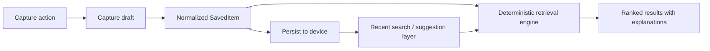
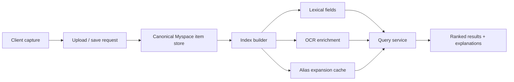

# Myspace Indexing and Retrieval Pipeline

## Purpose

Myspace is Sentri's deterministic memory layer for student content.

The current mobile implementation is local-first. It stores captured items on device, indexes them through predictable lexical signals, and explains why a result matched. This document defines the current pipeline and the backend sync path that can replace local-only storage later without changing the user-facing behavior.

## Current Pipeline

## Core Data Model

Myspace currently indexes the `SavedItem` shape from [app/src/features/myspace/models.ts](/Users/sahilkumarsingh/Desktop/SENTRI/app/src/features/myspace/models.ts):

- `id`
- `title`
- `body`
- `kind`
- `subject`
- `tags`
- `source`
- `dateLabel`
- `accent`
- `pinned`
- `featured`
- `ocrText`

These fields are sufficient for the current retrieval logic because ranking is driven by lexical matches, alias expansion, and deterministic UI hints rather than embeddings or external search infrastructure.

## Capture Ingestion

Capture actions are defined in [app/src/features/myspace/seed-data.ts](/Users/sahilkumarsingh/Desktop/SENTRI/app/src/features/myspace/seed-data.ts) as:

- `image`
- `link`
- `note`
- `file`
- `screenshot`

The capture flow is implemented in [app/src/features/myspace/capture-builder.ts](/Users/sahilkumarsingh/Desktop/SENTRI/app/src/features/myspace/capture-builder.ts).

### Capture Steps

1. The user picks a capture option.
2. Sentri creates a `CaptureDraft` with default values.
3. The draft is normalized into a `SavedItem`.
4. Missing fields are backfilled with deterministic defaults:
   - title fallback
   - subject fallback
   - source fallback
   - tags fallback
   - OCR fallback using combined `title + body`
5. The item is inserted at the top of the local collection and becomes searchable immediately.

### Current Normalization Rules

- `subject` defaults by capture type
- `accent` defaults by capture type
- `dateLabel` is currently stored as a human label such as `Now` or `Today`
- `featured` is set for newly captured items so they surface strongly when no query is active

## Persistence Layer

Myspace state is currently persisted with `usePersistedState` under:

- [app/src/lib/persistent-keys.ts](/Users/sahilkumarsingh/Desktop/SENTRI/app/src/lib/persistent-keys.ts)
  - `sentri.myspace.items`
  - `sentri.myspace.recentSearches`

This means the device currently owns:

- saved item storage
- recent search history
- search suggestions derived from that history

## Retrieval Engine

The retrieval engine lives in [app/src/features/myspace/retrieval-engine.ts](/Users/sahilkumarsingh/Desktop/SENTRI/app/src/features/myspace/retrieval-engine.ts).

### Match Reasons

The engine can explain matches using these categories:

- `title`
- `body`
- `subject`
- `subject-alias`
- `source`
- `date`
- `ocr`
- `tag`
- `context-alias`
- `semantic-alias`

### Score Signals

Current weighted signals are:

- title token match: `+28`
- OCR token match: `+22`
- subject alias match: `+20`
- subject token match: `+18`
- body token match: `+16`
- tag match: `+14`
- source match: `+12`
- context alias match: `+11`
- date label match: `+10`
- semantic alias match: `+9`

These weights intentionally keep the engine interpretable. Exact and obvious matches beat fuzzy context matches.

### Alias Strategy

The engine currently uses two alias maps:

- subject aliases
  - example: `math -> P&S`
  - example: `database -> DBMS`
- context aliases
  - example: `board -> blackboard`
  - example: `photo -> image`

This lets a student recover content through memory cues rather than exact saved titles.

### Empty Query Behavior

When the search query is empty:

- pinned items receive the strongest default ranking
- featured items get a secondary boost
- index order still matters as a recency proxy

This is why newly captured items and pinned notes remain discoverable without requiring a search query.

## Search Suggestions

Suggestion logic lives in [app/src/features/myspace/search-history.ts](/Users/sahilkumarsingh/Desktop/SENTRI/app/src/features/myspace/search-history.ts).

The suggestion list is built from:

- recent normalized searches
- subject names from saved items
- up to two tags per item
- a short title-derived fallback

This is intentionally lightweight. It improves recall without requiring a backend autocomplete service.

## UI Contract

The screen integration is currently in [app/src/screens/MyspaceScreen.tsx](/Users/sahilkumarsingh/Desktop/SENTRI/app/src/screens/MyspaceScreen.tsx).

The UI depends on three retrieval guarantees:

1. Results are deterministic.
2. Results return an explanation string.
3. Empty-state behavior remains stable for pinned, suggested, and newly captured items.

This contract matters because the UI already renders:

- pinned items
- search status
- search suggestions
- explanation labels
- detail previews

Any backend sync layer must preserve that behavior.

## Current Gaps

The current local-first design is fast but incomplete.

Known gaps:

- no canonical timestamp field separate from `dateLabel`
- no background OCR ingestion queue
- no server-side index
- no conflict resolution across devices
- no parser that enriches screenshots into structured board/text entities

## Backend Sync Target

The future server-side pipeline should preserve the same ranking semantics while moving storage and enrichment off-device.

Recommended target flow:

### Backend Responsibilities

- store canonical item timestamps and ownership
- persist OCR text separately from raw capture content
- materialize normalized tags and alias fields
- return ranked matches in the same explanation-first format used by mobile

### Mobile Responsibilities After Sync

- optimistic local create/update
- cached offline reads
- local recent-search history
- UI explanation rendering

## Recommended Next Steps

1. Add a canonical `createdAt` field to `SavedItem`.
2. Define a Spring Boot Myspace item entity and API contract.
3. Move alias maps into a shared backend/mobile config source.
4. Add ingestion status fields for OCR-backed captures.
5. Preserve explanation labels so server-side retrieval stays inspectable in the UI.
