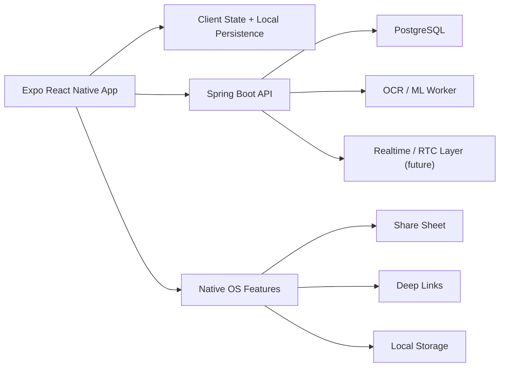
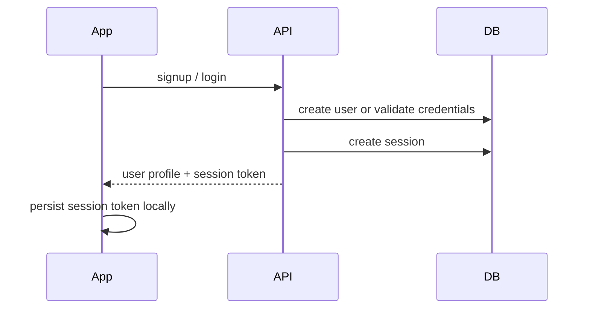
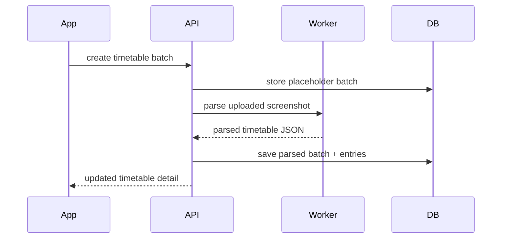
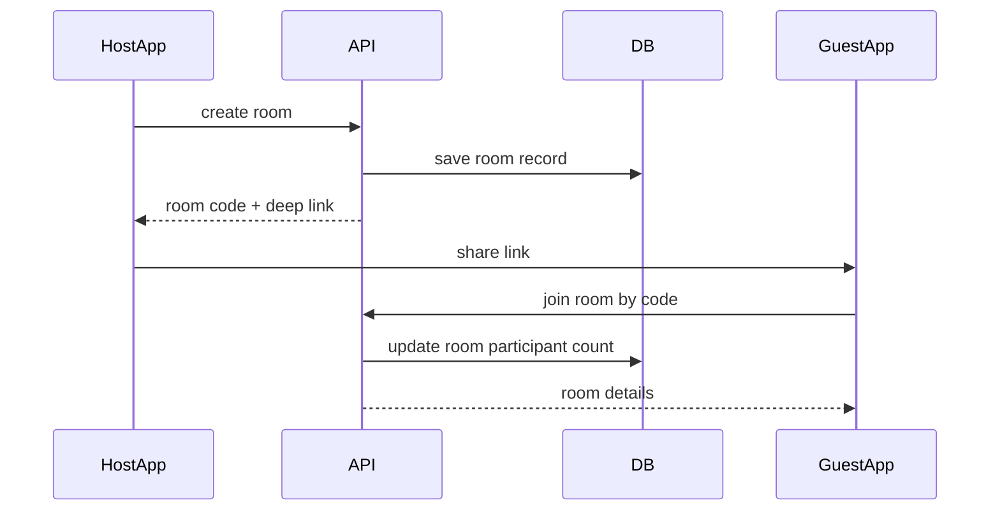

## Sentri System Design HLD

### Goal

Sentri serves AIT students with a single cross-platform mobile app and a lightweight backend. The architecture is designed for:

- low operational cost
- mobile-first responsiveness on average student phones
- local-first persistence for common flows
- simple horizontal growth as usage expands

### Product Domains

Sentri is split into five functional domains:

1. Authentication and session restore
2. Timetable ingestion and weekly refresh
3. Myspace capture and retrieval
4. Calorie planning and daily tracking
5. Hangout room creation and meeting workflow

### High-Level Architecture

### Responsibilities By Layer

#### Mobile App

- renders the student experience
- restores last signed-in session and last active page
- keeps lightweight feature state available offline
- defers expensive work until the user opens the feature
- sends only required network requests

#### Spring Boot Backend

- owns user, session, timetable batch, and hangout room records
- validates and normalizes client input
- exposes domain APIs for auth, timetable, and hangout
- handles read-heavy endpoints with cache-friendly patterns

#### PostgreSQL

- stores authoritative user, session, timetable, and hangout data
- uses indexed lookup keys for phone, email, room code, and recent records

#### OCR / ML Worker

- extracts structured timetable data from screenshots
- returns normalized JSON back to the backend

### Runtime Principles

#### Mobile Performance

- mount screens on demand instead of rendering all tabs eagerly
- persist only feature-specific slices of state
- reuse a shared storage layer with memory caching
- keep large screens split into smaller render boundaries
- defer expensive filtering and non-urgent UI work

#### Backend Performance

- separate read and write transaction intent
- cache read-mostly lists such as active rooms and timetable summaries
- index fields used in login, lookup, and sorting
- keep payloads DTO-based and avoid over-fetching

### Primary Data Flows

#### Auth

#### Weekly Timetable Refresh

#### Hangout Room Link

### Scale Strategy

For the current stage, Sentri is optimized for low-cost operation.

- local persistence reduces repeated network calls
- cacheable read endpoints protect the database from hot list traffic
- room, session, and user lookups use indexed fields
- future RTC should be separated from the Spring Boot core so heavy live media does not compete with auth and timetable APIs

### Future Evolution

- replace demo OCR handoff with a real async upload-processing queue
- move Hangout media into a dedicated RTC service such as LiveKit or self-hosted WebRTC SFU
- introduce background sync for timetable freshness reminders
- add search indexing for Myspace OCR text and semantic retrieval
